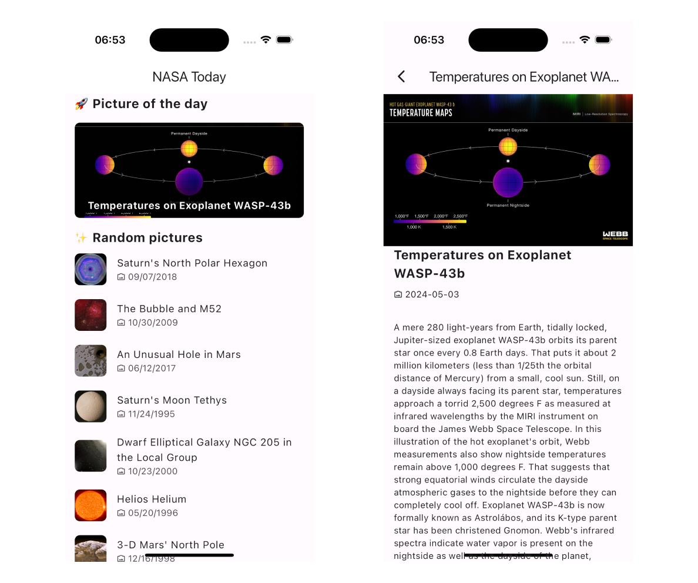

<h1 align="center">NASA Today - Flutter App</h1>

  <a href="#-technology">Technology</a>&nbsp;&nbsp;&nbsp;|&nbsp;&nbsp;&nbsp;
  <a href="#-project">Project</a>&nbsp;&nbsp;&nbsp;|&nbsp;&nbsp;&nbsp;
  <a href="#-how-to-contribute">How to Contribute</a>&nbsp;&nbsp;&nbsp;

  <row>
    
    
    
  </row>

 

  

## 🚀 Technology

This project was development with:

- [Flutter](https://flutter.dev/)
- [Mobx](https://pub.dev/packages/mobx)

## 💻 Project

Build an app for one platform (Android or iOS) to show the pictures from NASA's "Astronomy Picture of the Day" website in a fashion manner.

One of the most popular websites at NASA is the Astronomy Picture of the Day. In fact, this website is one of the most popular websites across all federal agencies.

## 🤔 How to contribute?

- Fork this repository;
- Create a branch with your feature: `git checkout -b feature/your_feature_name`;
- Commit your changes: `git commit -m 'feat: My new feature'`;
- Push your commit to your branch: `git push origin feature/your_feature_name`.
- After the merge of your pull request is done, you can delete your branch.

PS.: You must use the NASA API. You can create a free account and use the API key generated right after signing up. Use your api in `config.json` file from root project.
API documentation: https://api.nasa.gov (click Browse APIs and check APOD)

---

Create with ♥ by Michael Martins
